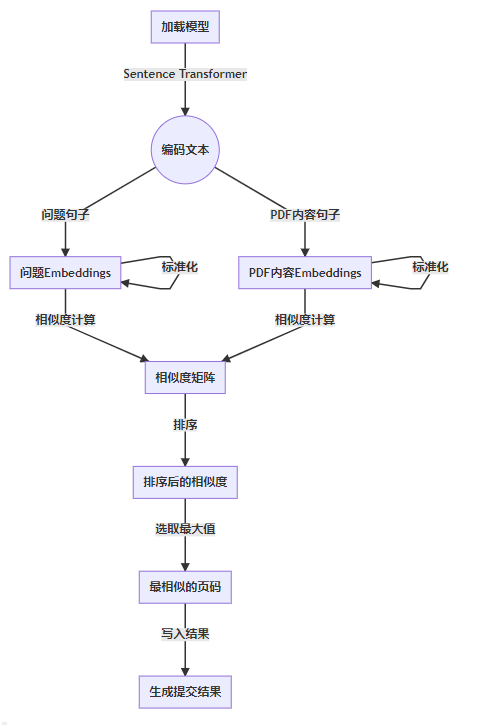

# Day 5 文本嵌入与向量检索（Embedding and Retrieval）

## 语义检索流程

语义检索是通过词嵌入和句子嵌入等技术，将文本表示为语义丰富的向量，再通过相似度计算和结果排序找到最相关的文档的检索过程。

## 文本切分（Split/chunk）

文本切分就是将长文本切成多个chunks.Split的主要原因是LLM对于long text处理能力不足，一方面long text可能会使得在后面RAG generation过程中，超过LLM limited tokens；另一方面为了避免"lost in the middle"现象。

在RAG中，文本切分不是必须的。当页面中文本内容较多的时候，文本切分就是必要的。当然如果页面的文本内容不多，就是本项目的数据那样，其实文本切分就没有那么必要了。

文本切分中，chunk size比较关键。一个好的split的结果是含有相似语义的文本被分到同一个chunk中，并且这个chunk中不相关信息较少。为了保证连贯性，两个chunk之间会存在一个overlap。overlap 的size一般控制在整个chunk size的20%。Overlap不是必须的。值得注意的是chunksize是会影响到embed以及后续的搜索结果。短文本和长文本在编码成向量时可能表达不同的语义信息。即使两者包含相同的单词或有相似的语义，由于上下文的不同，得到的向量也会有所不同。

Langchain中有很多文本切分的方法，下面来依次展开：

### Split by character

The text is splited based on the character and chunk length.

```{python}
from langchain.text_splitter import CharacterTextSplitter

text_splitter = CharacterTextSplitter(
    separator="\n\n",
    chunk_size=1000,
    chunk_overlap=200,
    length_function=len,
    is_separator_regex=False,
)
texts = text_splitter.create_documents(text)
```

`CharacterTextSplitter`一般先以separator为标准，如果在两个separator之间的chunk size大于给定的chunk size，则根据chunk size进行split。The default separator of `CharacterTextSplitter` is "".当存在chunk overlap的时候，从需要分割的位点往前数chunk overlap的长度，作为下一次的分割起点。这样前一个chunk的后面部分会和后一个chunk的前面部分是相同的。这边需要注意split的位点在哪里。

### Recursively split by character

```{python}
from langchain.text_splitter import RecursiveCharacterTextSplitter
text_splitter = RecursiveCharacterTextSplitter(
    chunk_size=100,
    chunk_overlap=20,
    length_function=len,
    is_separator_regex=False,
)
texts = text_splitter.create_documents(text)
```

`RecursiveCharacterTextSplitter`是比较常见的text splitter。与上面的`CharacterTextSplitter`相比，不同之处在于这边是按照separator元素的顺序进行循环split的。只有当两个separator元素之间的长度大于给定的chunk size时，才会根据chunk size进行分割。这边同样需要注意split的位点在哪里。

### Document Specific Chunking

Langchain为HTML,Markdown,code and Json 提供专门的splitter。 具体见：
[HTML](https://python.langchain.com/docs/modules/data_connection/document_transformers/HTML_header_metadata), [Markdown](https://python.langchain.com/docs/modules/data_connection/document_transformers/markdown_header_metadata), [Code](https://python.langchain.com/docs/modules/data_connection/document_transformers/code_splitter),[Json](https://python.langchain.com/docs/modules/data_connection/document_transformers/recursive_json_splitter).

### Semantic Chunking

这种splitter的一个优点在于可以尽可能的将同一个semantic meaning的文本内容放在一个chunk之中。

这边主要的思想来源于：[https://github.com/FullStackRetrieval-com/RetrievalTutorials/blob/main/5_Levels_Of_Text_Splitting.ipynb]。即是先尽量切割，然后根据文本的embed之间相似度对分割的文本进行合并。

```{python}
from langchain_experimental.text_splitter import SemanticChunker
from langchain_openai.embeddings import OpenAIEmbeddings
text_splitter = SemanticChunker(OpenAIEmbeddings())
docs = text_splitter.create_documents(text)
```

但是Langchain这个chunking有点不太稳定，有一些时候可能会报错。

这边推荐[ChunkViz](https://chunkviz.up.railway.app/)网站，可以非常清楚的知道你的文本应该需要chunksize的范围。

## 文本编码模型 （Embedding）

Embedding对于语义检索的精度至关重要。合适的文本编码模型直接影响到得到的文本向量的有效性，进而影响检索的准确性和效果。Embedding可以分为静态和动态的。OpenAI的text-embedding-ada-02就是基于GPT而构建的dynamic Embedding。Embedding model可以在[编码模型排行榜](https://huggingface.co/spaces/mteb/leaderboard)中查询。

```{python}
from sentence_transformers import SentenceTransformer
model = SentenceTransformer('../hugging-face-model/moka-ai/m3e-small/')

question_sentences = [x['question'] for x in questions]
pdf_content_sentences = [x['content'] for x in pdf_content]

question_embeddings = model.encode(question_sentences, normalize_embeddings=True)
pdf_embeddings = model.encode(pdf_content_sentences, normalize_embeddings=True)

for query_idx, feat in enumerate(question_embeddings):
    score = feat @ pdf_embeddings.T
    max_score_page_idx = score.argsort()[-1] + 1
    questions[query_idx]['reference'] = 'page_' + str(max_score_page_idx)

with open('submit.json', 'w', encoding='utf8') as up:
    json.dump(questions, up, ensure_ascii=False, indent=4)

```

```{python}
model = SentenceTransformer('../hugging-face-model/BAAI/bge-small-zh-v1.5/')

# 剩余代码与M3E部分相同
```

```{python}
model = SentenceTransformer("../hugging-face-model/maidalun1020/bce-embedding-base_v1", device='cuda')
model.max_seq_length = 512

# 剩余代码与M3E部分相同

```


